<!-- AI-AGENT-META-START -->
<!--
skill: ppt-content-to-deck-image-first
description: 中文公司宣传 PPT 一键生成（领导汇报 / 政企 / 党政 / 央国企 / 16 种视觉风格），3-phase cover-pick loop，不锁风格。
install: curl -fsSL https://raw.githubusercontent.com/yaoywei/ppt-content-to-deck-image-first/main/install.sh | bash
triggers: "用 ppt-content-to-deck-image-first 风格做 PPT", "给领导看", "领导汇报", "政企风格", "参考这份 PPT 的风格", "做成 PPT", "首图选风格", "公司简介 PPT"
audience: 中文公司 (路演 / 政企 / 党政 / 央国企 / 商业计划 / 项目介绍 / 茶酒文旅 / 教育母婴 / 银行工业 / 美妆AI / 营销培训)
tldr: 输入公司内容，AI 出 3 张候选封面让你挑，再批量出剩下 10-15 页，最后拼成 .pptx/.pdf。覆盖 16 种视觉风格 - 领导汇报/科技/茶酒/教育/银行/工业/高定/家居/美妆/AI/运维/投行/创业/营销/行业/培训，一行命令装上，10 秒上手。
-->
<!-- AI-AGENT-META-END -->

# ppt-content-to-deck-image-first

**中文公司宣传 PPT 一键生成 · 3-phase cover-pick loop · 16 种风格覆盖**

---

## 这是什么

把一段**中文公司介绍文本**（500-2000 字），一键生成**10-15 页**专业 PPT，**输出 .pptx + .pdf**。

**3 阶段工作流**：
1. **Phase 0**：分析内容 + 跟用户对齐风格
2. **Phase 1**：出 2-3 张**候选封面**（不同视觉风格），用户挑 1 个
3. **Phase 2**：用挑中的风格**批量出 10-15 张内容页**
4. **Phase 3**：拼成 .pptx（python-pptx）+ .pdf

**为什么这样做**：image-gen 主观性强。**先出 1 张封面让用户挑** = 把"返工 16 张"降到"返工 1 张"。

---

## 16 种风格样图（**直接看，不用花钱生成**）

| | | |
|:---:|:---:|:---:|
|  | 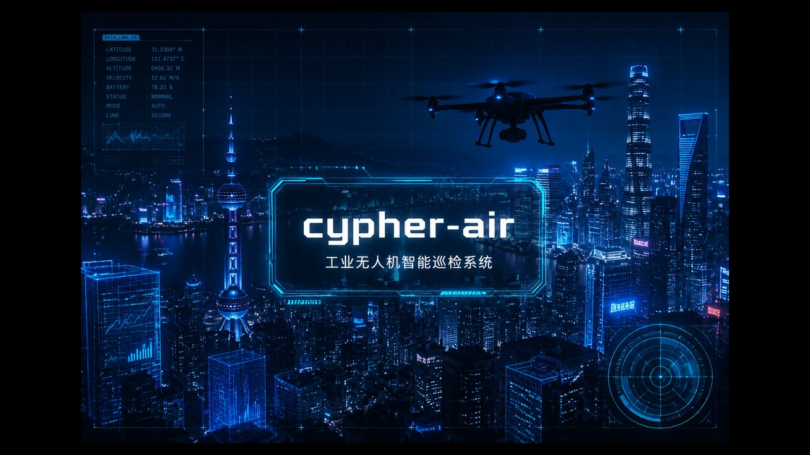 | 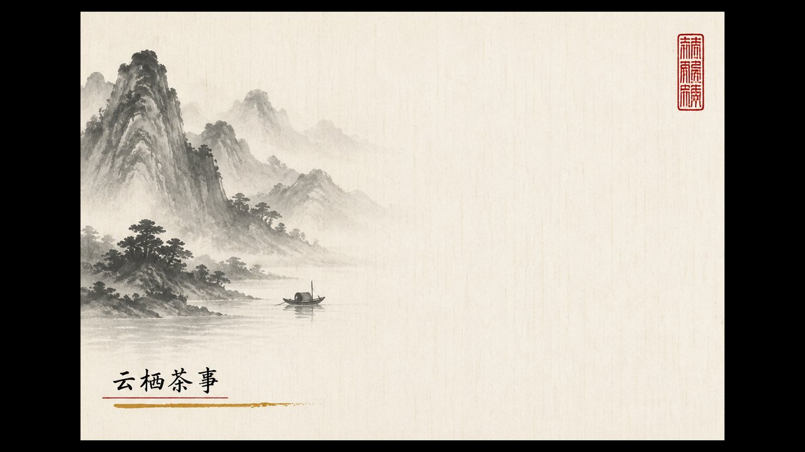 |
| **领导汇报 / 政企 / 党政** | **科技 / 路演 / 投资人** | **茶饮 / 白酒 / 中医药 / 文旅国潮** |
| 白底+深蓝+红+斜切 | 深色+电光蓝+HUD | 留白+水墨+篆刻 |
| 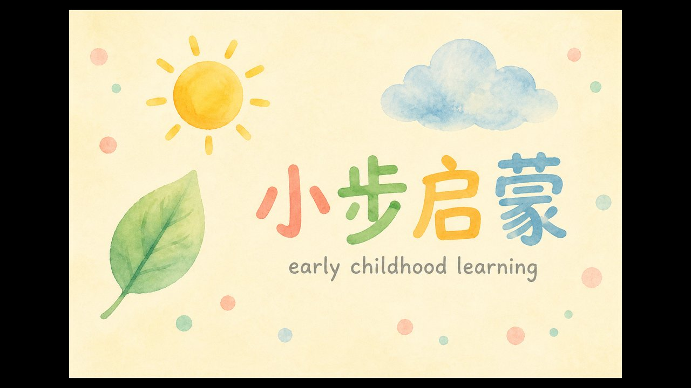 | 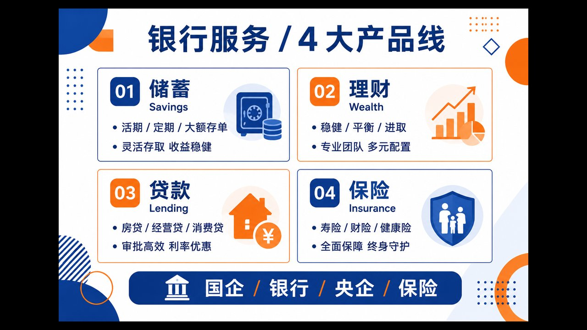 | 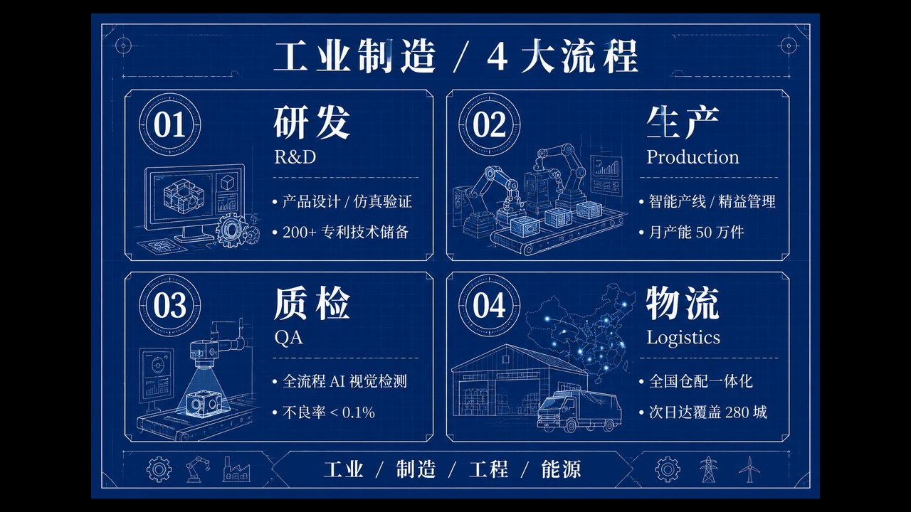 |
| **教育 / 母婴 / 心理 / 公益** | **国企 / 银行 / 央企 / 保险** | **工业 / 制造 / 工程 / 能源** |
| 暖色+水彩+童趣 | 白底+蓝橙+几何 | 蓝底+技术线条+数据 |
| 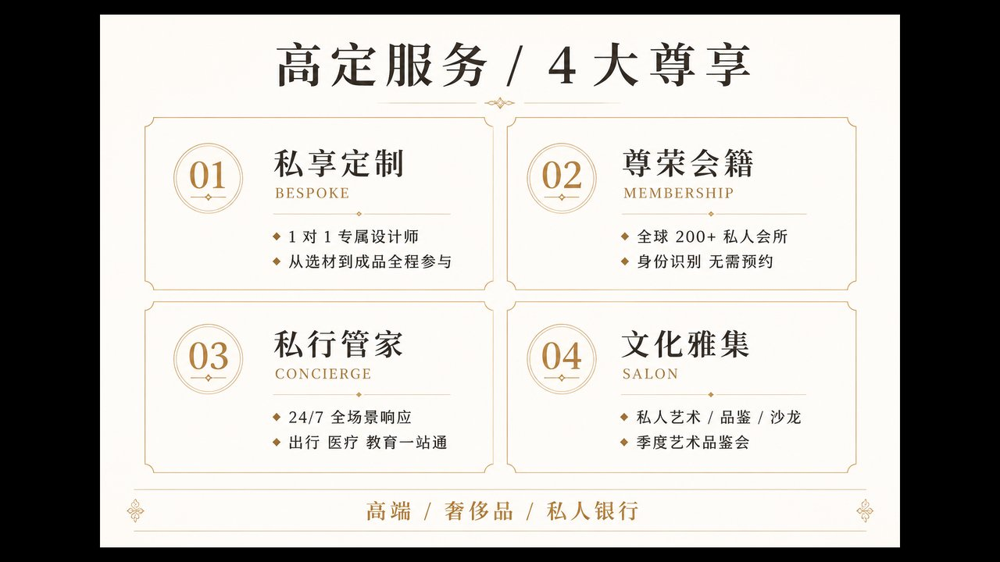 | 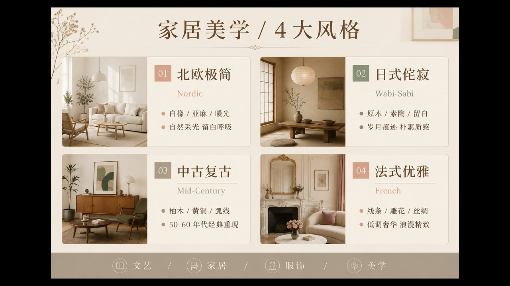 | 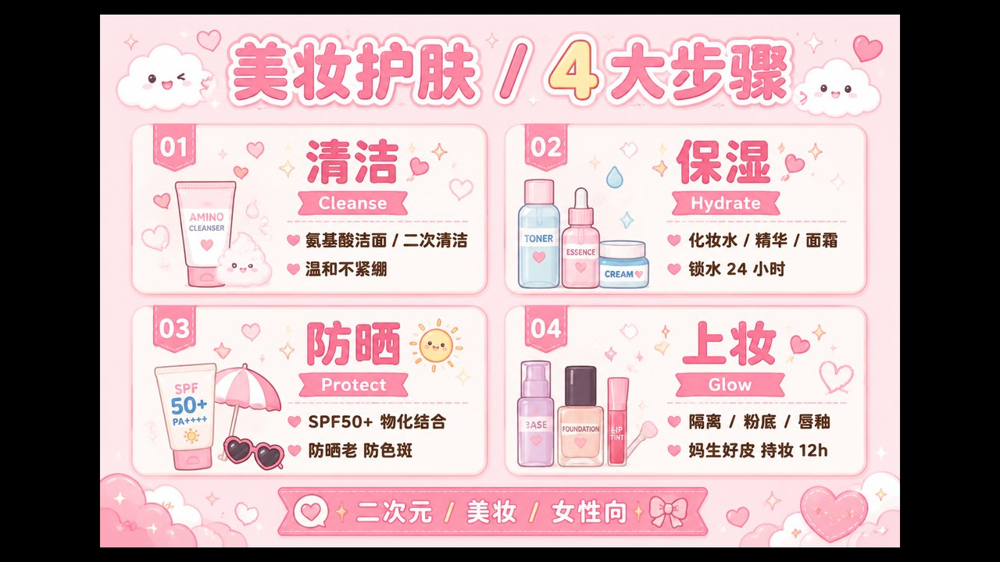 |
| **高端 / 奢侈品 / 私人银行** | **文艺 / 家居 / 服饰 / 美学** | **二次元 / 美妆 / 女性向** |
| 米黄+金+衬线 | 莫兰迪+杂志感 | 粉嫩+卡通+爱心 |
| 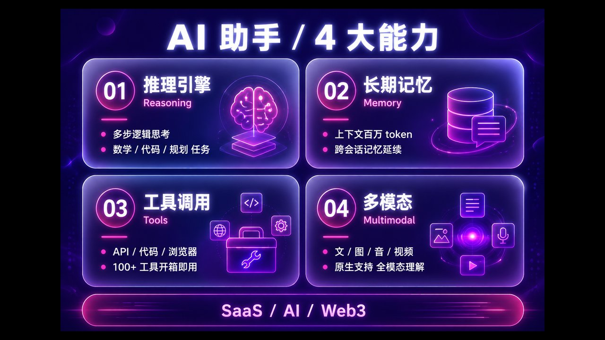 | 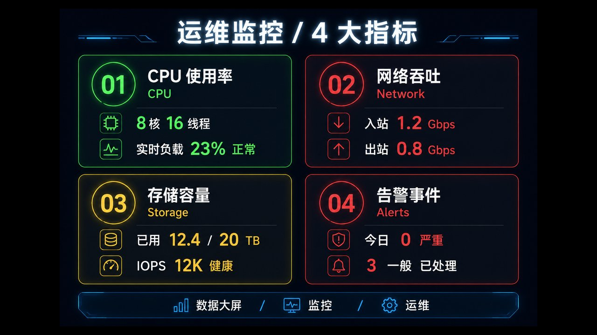 | 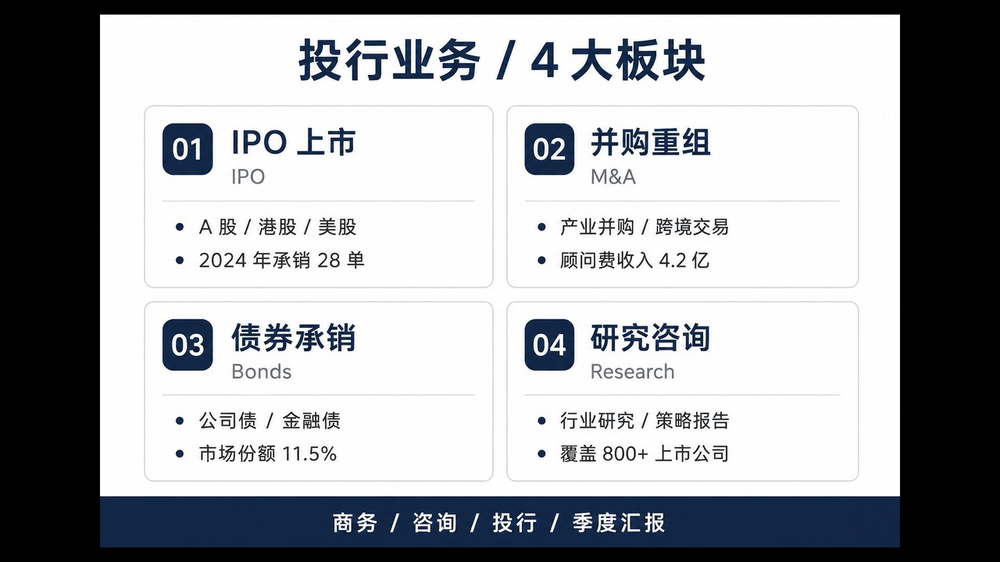 |
| **SaaS / AI / Web3** | **数据大屏 / 监控 / 运维** | **商务 / 咨询 / 投行 / 季度汇报** |
| 紫底+毛玻璃+霓虹 | 黑底+霓虹仪表 | 白底+深灰+极简 |
| 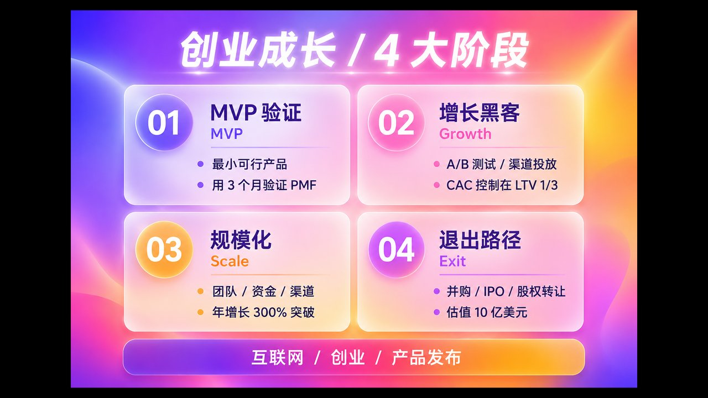 | 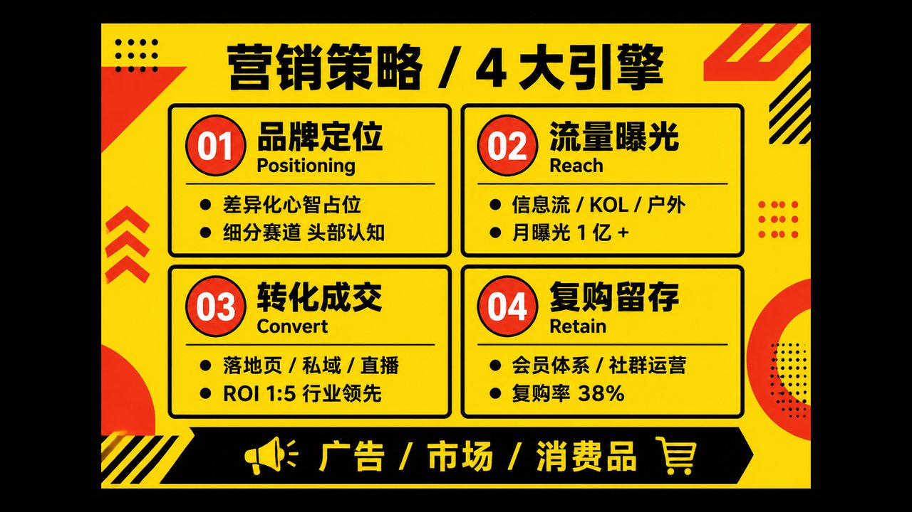 | 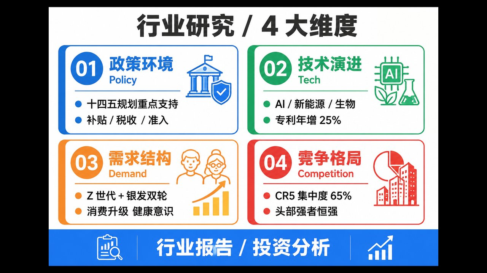 |
| **互联网 / 创业 / 产品发布** | **广告 / 市场 / 消费品** | **行业报告 / 投资分析** |
| 渐变+玻璃+活力 | 黄色+粗线+波普 | 四色+方块+实验室 |
| 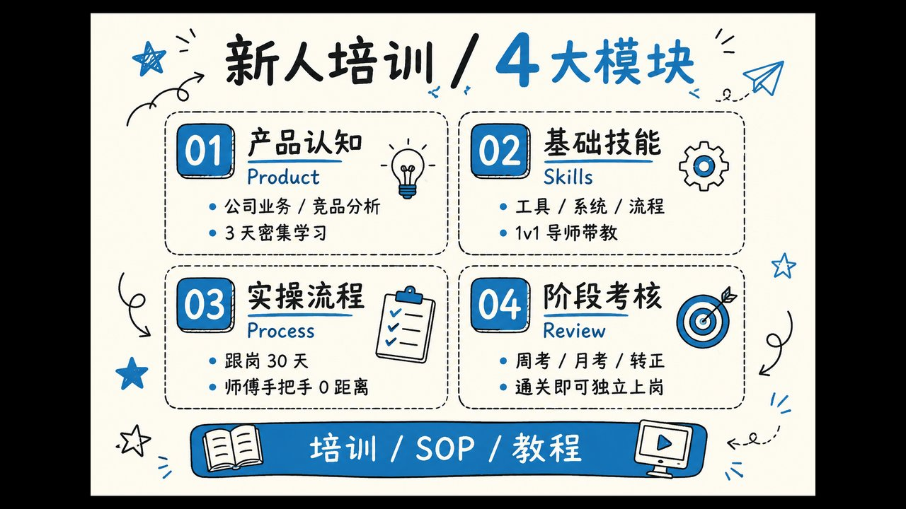 |  |  |
| **培训 / SOP / 教程** | **领导汇报 · P4 资质荣誉** | ⚠️ **反面教材** |
| 手绘+童趣+SOP | 证书墙 | 别这样出领导汇报 |

> **风格来源说明**：本仓库的"领导汇报"风格参考了**一份真实政企 PPT 的版式**（已脱敏）。提取方式见 `references/learn-from-reference-ppt.md` —— 用户给参考 PPT 时，**必须先 vision 提取 4-6 页版式**（pptx→pdf→png→vision\_analyze），**再**写 prompt。
>
> **⚠️ 反面教材**：右下角图是 agent 凭"中国领导汇报 PPT 是什么样"的训练均值猜的封面（错 6/7 维度），**别这样出领导汇报 PPT**。要看"对"长什么样，看第一行的领导汇报样张。

---

## 适合谁用

| 场景 | 推荐风格 |
|---|---|
| **领导汇报 / 政企 / 党政** | 白底+深蓝+金 / 白底+红色+斜切 |
| **路演 / 投资人 / 科技产品发布** | Cyberpunk Neon / Neon Glassmorphism |
| **茶饮 / 白酒 / 中医药 / 文旅国潮** | Chinese Ink |
| **教育 / 母婴 / 心理 / 公益** | Watercolor Soft |
| **国企 / 银行 / 央企 / 保险** | Corporate Memphis |
| **工业 / 制造 / 工程 / 能源** | Blueprint |
| **高端 / 奢侈品 / 私人银行** | Elegant Serif |
| **文艺 / 家居 / 服饰 / 美学** | Morandi Journal |
| **二次元 / 美妆 / 女性向** | Kawaii |
| **SaaS / AI / Web3** | Neon Glassmorphism |
| **数据大屏 / 监控 / 运维** | Dark Mode Dashboard |
| **商务 / 咨询 / 投行 / 季度汇报** | Light Mode Clean |
| **互联网 / 创业 / 产品发布** | Gradient Mesh |
| **广告 / 市场 / 消费品** | Bold Graphic |
| **行业报告 / 投资分析** | Pop Laboratory |
| **培训 / SOP / 教程** | Hand-drawn Edu |

---

## 安装

**一行命令**（推荐）：

```bash
curl -fsSL https://raw.githubusercontent.com/yaoywei/ppt-content-to-deck-image-first/main/install.sh | bash
```

**作用**：克隆本仓库到 `~/.hermes/skills/ppt-content-to-deck-image-first/`，下次 `skill_view name="ppt-content-to-deck-image-first"` 就能加载。

**直接告诉 agent**（最快）：

> 请帮我安装 github.com/yaoywei/ppt-content-to-deck-image-first

**更新**：

```bash
cd ~/.hermes/skills/ppt-content-to-deck-image-first && git pull origin main
```

**卸载**：

```bash
rm -rf ~/.hermes/skills/ppt-content-to-deck-image-first
```

---

## 用法（10 秒上手）

1. **告诉 agent 你的公司内容**（一段 500-2000 字的中文介绍）
2. **说"用 ppt-content-to-deck-image-first 风格做成 PPT"**
3. **agent 会问你 3-4 个对齐问题**（受众、风格偏好、页数、是否需要文字可编辑）
4. **出 2-3 张候选封面 → 你挑 1**
5. **批量出剩下 10-15 页**
6. **拼成 .pptx + .pdf，交付**

**示例 prompt**（直接发给你的 agent）：

> 我公司是做工业无人机智能巡检的，主要客户是电网和油气管线。最近要做一份 12 页的 PPT 给南方电网的领导汇报。
>
> 请用 ppt-content-to-deck-image-first 风格做，**给领导看**所以要稳重（白底+深蓝+红+斜切那种），文字要可编辑（领导会改几个字）。

---

## 触发关键词

| 关键词 | 加载什么 |
|---|---|
| "做成 PPT" / "生成 PPT" / "首图选风格" | 主 skill |
| "给领导看" / "领导汇报" / "政企" / "党政" | 加载 `references/leadership-deck-style-rules.md` |
| "参考这份 PPT 的风格" / "按这个风格做" | 加载 `references/learn-from-reference-ppt.md`，**先 vision 提取** |
| "路演" / "投资人" / "科技公司" / "低空经济" | 默认 Cyberpunk Neon 风格 |
| "茶" / "酒" / "国潮" / "文旅" / "中医药" | 默认 Chinese Ink 风格 |
| "教育" / "母婴" / "心理" / "公益" | 默认 Watercolor Soft 风格 |
| "银行" / "国企" / "保险" / "央企" | 默认 Corporate Memphis 风格 |
| "工业" / "制造" / "能源" / "工程" | 默认 Blueprint 风格 |
| "AI" / "SaaS" / "Web3" | 默认 Neon Glassmorphism 风格 |
| "培训" / "SOP" / "教程" | 默认 Hand-drawn Edu 风格 |

---

## 仓库结构

```
ppt-content-to-deck-image-first/
├── SKILL.md                                          # 主 skill（3-phase loop + 30+ pitfalls）
├── install.sh                                        # 一键安装脚本
├── README.md                                         # 本文件
├── build-pptx.py                                     # 拼 .pptx 的入口脚本
├── post-process.py                                   # 后处理（padding + logo overlay）
├── build-style-showcase*.py                          # 风格索引页生成脚本
├── examples/                                         # 真实样图（不花钱就能看）
│   ├── cover-red-diagonal.png                        # 领导汇报风封面
│   ├── p02-company-overview.png                      # 领导汇报风 P2
│   ├── p03-mission-positioning.png                   # 领导汇报风 P3
│   ├── p04-qualifications.png                        # 领导汇报风 P4
│   ├── anti-pattern-blind-guess-blue-gold.png        # 反面教材
│   ├── style-cyberpunk-neon-4use.jpg                 # 科技/路演 4 大应用场景
│   ├── style-chinese-ink-4tea.jpg                    # 茶酒 4 时饮茶
│   ├── style-watercolor-soft-4kids.jpg               # 教育 4 大能力培养
│   ├── style-corporate-memphis-4bank.jpg             # 银行 4 大产品线
│   ├── style-blueprint-4factory.jpg                  # 工业 4 大流程
│   ├── style-elegant-serif-4luxury.jpg               # 高定 4 大尊享
│   ├── style-morandi-journal-4home.jpg               # 家居 4 大风格
│   ├── style-kawaii-4beauty.jpg                      # 美妆 4 大步骤
│   ├── style-neon-glassmorphism-4ai.jpg              # AI 4 大能力
│   ├── style-dark-mode-dashboard-4ops.jpg            # 运维 4 大指标
│   ├── style-light-mode-clean-4banker.jpg            # 投行 4 大板块
│   ├── style-gradient-mesh-4startup.jpg              # 创业 4 大阶段
│   ├── style-bold-graphic-4ads.jpg                   # 营销 4 大引擎
│   ├── style-pop-laboratory-4research.jpg            # 行业 4 大维度
│   ├── hand-drawn-edu-4training.jpg                  # 培训 4 大模块
│   ├── style-showcase-*.png                          # 21 风格 PIL 索引页（备用）
│   └── ...
└── references/                                       # 按需加载的 reference 文档
    ├── leadership-deck-style-rules.md                # 领导汇报风格规则
    ├── learn-from-reference-ppt.md                   # 复刻参考 PPT 的 recipe
    ├── style-options.md                              # 默认 3 风格说明
    ├── style-library.md                              # 21 风格扩展库
    ├── cover-prompt-template.md                      # 封面 prompt 模板
    ├── prompt-as-code-template.md                    # Prompt-as-Code 7-section 版
    ├── china-ad-law-phrases.md                       # 广告法红线词
    └── python-pptx-stitch-recipe.md                  # python-pptx 拼图脚本
```

---

## 与其他 skill 的关系

| Skill | 关系 |
|---|---|
| `ppt-from-template` | 复刻参考 PPT 的版式（视觉/排版细节复刻）—— 本 skill 偏向"按风格自由生成" |
| `mck-ppt-design` | 麦肯锡咨询风，**纯 python-pptx 不用 AI 生图** —— 本 skill 偏向 AI 生图 + overlay |
| `dragon-ppt-maker` | 另一种 PPT 生成路径 |
| `ppt` | 单 HTML 文件的乔布斯风演示稿 —— 本 skill 是 .pptx/.pdf |
| `powerpoint-pptx` | 编辑/读取 .pptx 文件结构 —— 本 skill 用其作为底层 |

---

## License

MIT

## 作者

[yaoywei](https://github.com/yaoywei)
